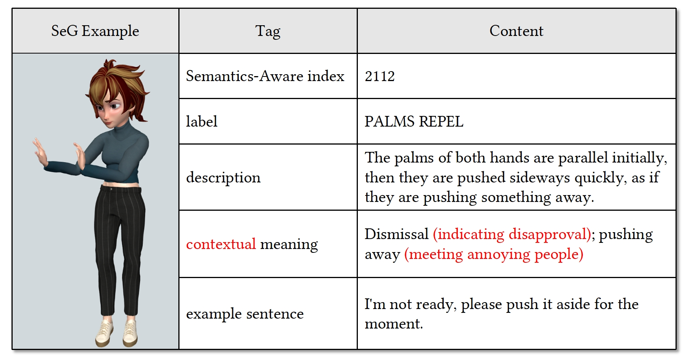

# SIGGRAPH 2024 Journal Track<br /> Semantic Gesticulator: Semantics-Aware Co-Speech Gesture Synthesis

[Zeyi Zhang*](https://lumen-ze.github.io/), [Tenglong Ao*](https://aubrey-ao.github.io/), Yuyao Zhang*, [Qingzhe Gao](https://talegqz.github.io/), Chuan Lin, [Baoquan Chen](https://cfcs.pku.edu.cn/baoquan/), [Libin Liu†](http://libliu.info/)


***
<p align=center>
 </img>
</p>

<p align="center">
-
Video (<a href="https://www.youtube.com/watch?v=gKGqCE7id4U">YouTube</a> | <a href="https://www.youtube.com/watch?v=gKGqCE7id4U">Bilibili</a>)
-
Paper (<a href="https://arxiv.org/abs/2210.01448/">arXiv</a>)
-
Project Page (<a href="https://pku-mocca.github.io/Semantic-Gesticulator-Page/">github</a>)
-

</p>

This is a reimplemention of Semantic Gesticulator: Semantics-Aware Co-Speech Gesture Synthesis.

This codebase provides:
- [x] SeG dataset
- [ ] pretrained models
- [ ] training & inference codes

If you use the dataset or codes, please cite our [Paper](https://arxiv.org/abs/2401.01885)

```
@article{
  Zhang2024SemanticGesture,
  author = {Zhang, Zeyi and Ao, Tenglong and Zhang, Yuyao and Gao, Qingzhe and Lin, Chuan and Chen, Baoquan and Liu, Libin},
  title = {Semantic Gesticulator: Semantics-Aware Co-Speech Gesture Synthesis},
  journal = {ACM Trans. Graph.},
  issue_date = {July 2024},
  numpages = {17},
  doi = {10.1145/3658134},
  publisher = {ACM},
  address = {New York, NY, USA},
  keywords = {co-speech gesture synthesis, multi-modality, retrieval augmentation}
}
```

## SeG Dataset
> **Collection Period** of the semantic gesture inventory/list and the motion capture data: ```December 2023 - May 2024```.<br /> <br /> 
> **Copyright Source** of semantic gestures: the "Copyright Source" column in ```SeG_list.xlsx``` indicates the source of each semantic gesture, with the copyright belonging to the respective references.

The MOCCA Semantic Gesture Dataset (SeG) comprises 208 types of semantic gestures commonly utilized globally. Each record in the dataset includes a sequence of captured motions and associated meta-information.


As shown below, the meta-information includes semantics-aware index, label, description, contextual meaning, and example sentence, facilitating a thorough organization and analysis of human gestures. The related information is stored in ```./SeG_dataset/SeG_list.xlsx```.

<p align=center>
 </img>
</p>

As for motion, we have open-sourced the motion capture data from a male performer, comprising 544 motion files in the .bvh format. Each gesture is represented, on average, in 2.6 distinct ways. These motion files are named using the format "label" + "represented index" and stored in ```./SeG_dataset/bvh```. You can also get these files in the .zip format from [Google Drive](https://drive.google.com/file/d/1qVQ4-XwAzhfoHRM6EzR9BrGI1lD1vqVW/view?usp=sharing).

## Code
coming soon ...


<!-- [](https://star-history.com/#heyuanYao-pku/Control-VAE&Date) -->

